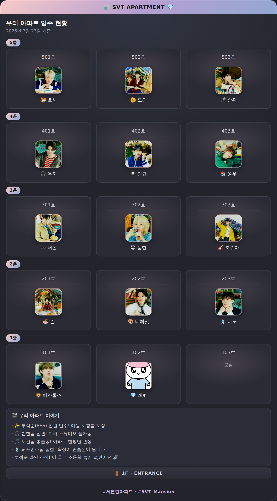
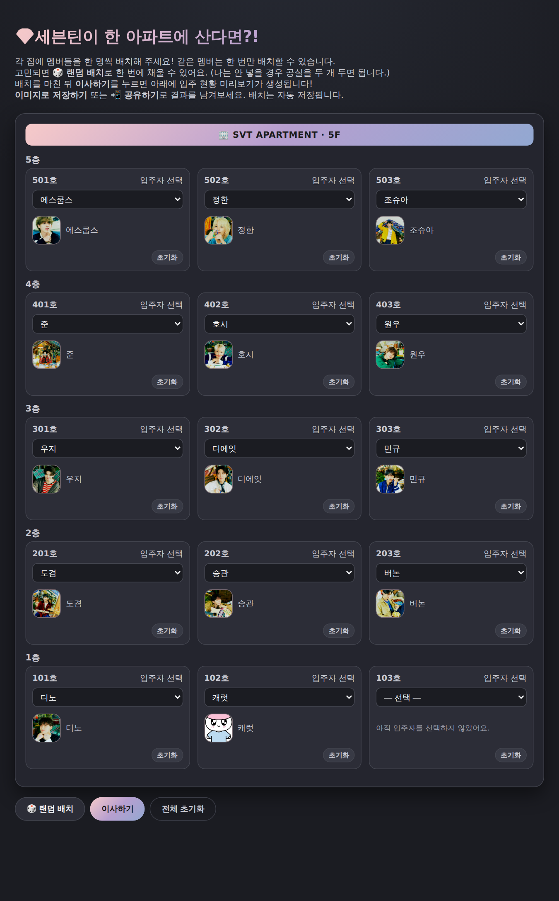

<div align="center">

# 💎 SVT Mansion — 세븐틴이 한 아파트에 산다면?!

**SEVENTEEN 멤버를 5층 아파트에 직접 배치하고, 결과를 이미지로 저장·공유하는 팬용 웹 놀이**

배치 → 미리보기 → 원탭 공유까지, 트위터에 올리기 좋은 결과 카드를 만들어 줍니다.

### ▶️ [지금 플레이하기](https://alfira0526.github.io/SVT_Mansion/)

`https://alfira0526.github.io/SVT_Mansion/`



</div>

---

## 🎮 무엇을 하는 게임인가요?

5층 × 3호 = **15세대** 아파트에 SEVENTEEN 멤버 13명 + `캐럿(나)`을 한 명씩 배치하는 놀이입니다.
같은 멤버는 한 번만 배치할 수 있고, 빈 집은 `공실`로 둡니다. 배치를 마치면 **입주 현황 카드**가 만들어지고, 이미지로 저장하거나 SNS에 바로 공유할 수 있습니다.

## ✨ 주요 기능

| 분류 | 기능 |
|---|---|
| **배치** | 호실별 드롭다운 선택 · 같은 멤버 중복 방지(선택되면 목록에서 자동 제외) · 🎲 **랜덤 배치** · 호실별/전체 초기화 |
| **저장/복원** | 배치 상태 **localStorage 자동 저장** — 새로고침해도 유지 |
| **공유** | 결과 카드 **PNG 저장** · 📲 **원탭 공유(Web Share API)** — 미지원 환경에선 저장 + 해시태그 문구 클립보드 복사로 폴백 |
| **결과 카드** | 아파트 메타포(옥상 사인·층 태그·창문형 유닛·1F 출입구) · 날짜·해시태그 브랜딩 자동 포함 |
| **이웃 이벤트** | 멤버별 성격 이모지 배지 · **위치 기반 케미 이벤트**(옆집/위아래 라인 인접·그룹 소집) → "🎬 우리 아파트 이야기"로 결과 카드에 자동 생성 |
| **디자인** | SEVENTEEN 상징색(Rose Quartz·Serenity) 그라디언트 · 통일된 라운드 아바타 · 배치 팝 애니메이션 |
| **안정성** | 전송 상태 토스트 · html2canvas 로컬 벤더 + CDN 폴백 · 깨진 이미지 폴백 · 접근성(aria/포커스) |

## 🚀 실행 방법

**바로 플레이:** 👉 https://alfira0526.github.io/SVT_Mansion/

로컬에서 열려면 별도 빌드나 서버가 필요 없습니다.

```bash
# 저장소를 받은 뒤
open index.html        # macOS
# 또는 브라우저로 index.html 파일을 그냥 열기
```

정적 파일이므로 GitHub Pages 등 어떤 정적 호스팅에도 그대로 올릴 수 있습니다.

## 🖼️ 화면

| 배치 화면 | 결과 카드 |
|---|---|
|  |  |

## 🗂️ 프로젝트 구조

```
SVT_Mansion/
├─ index.html              # 게임 본체 (HTML/CSS/JS 인라인, 단일 파일)
├─ image/                  # 멤버 프로필 이미지 (.jpeg)
├─ vendor/
│  ├─ html2canvas.min.js   # 이미지 저장용 라이브러리 (로컬 벤더, 버전 고정)
│  └─ README.md            # 벤더링 방식 설명
├─ apps_script/
│  ├─ Code.gs              # 결과 수집 백엔드 (Google Apps Script, 하드닝판)
│  └─ README.md            # 배포 절차·시트 매핑·보안 한계
├─ docs/
│  ├─ ARCHITECTURE.md      # 기술 개요(데이터 흐름·핵심 함수)
│  ├─ editor.png / preview.png
├─ CHANGELOG.md            # 개선 이력
├─ WORK_LOG.md             # 작업 로그(A/B/C·2차·3차)
└─ README.md               # (이 문서)
```

## 🔧 기술 스택

- **프런트엔드**: 순수 HTML/CSS/JavaScript (프레임워크·빌드 없음, 단일 `index.html`)
- **이미지 저장**: [html2canvas](https://html2canvas.hertzen.com/) 1.4.1 — 로컬 벤더 우선, 실패 시 jsdelivr → unpkg 폴백
- **공유**: Web Share API (Level 2, 파일 공유) + 클립보드 폴백
- **결과 집계(선택)**: Google Apps Script 웹앱 → Google Sheets ([설정](apps_script/README.md))

## 📊 결과 집계 백엔드 (선택)

**이사하기** 시 배치 결과를 Google Sheets로 전송해 집계할 수 있습니다. 서버 코드와 배포 방법은 [`apps_script/README.md`](apps_script/README.md)를 참고하세요. 서버측 스키마 검증·허니팟·크기 상한으로 스팸/오입력을 걸러냅니다.

## 🧑‍💻 개발 / 테스트

로직 회귀는 [Playwright](https://playwright.dev/)(Chromium)로 헤드리스 검증합니다: 랜덤 배치·중복 방지·자동저장/복원·전체 초기화·미리보기·이미지 저장/공유 폴백·허니팟·전송 스로틀. 실제 저장 이미지는 **실물 html2canvas 렌더**로 확인합니다.

## 📝 개선 이력

버전별 변경은 [`CHANGELOG.md`](CHANGELOG.md)를 참고하세요. 크게 **A(재미·공유) → B(안정성) → C(비주얼) → 밝기/백엔드 보안/벤더링 → 공유 이미지 버그 수정** 순으로 발전했습니다.

## ⚠️ 저작권 안내

본 프로젝트는 **비영리 팬 제작물**입니다. `image/` 의 멤버 사진 등 모든 초상·상표 권리는 원 권리자(PLEDIS Entertainment / HYBE 및 아티스트 본인)에게 있습니다. 상업적 사용을 의도하지 않습니다.
